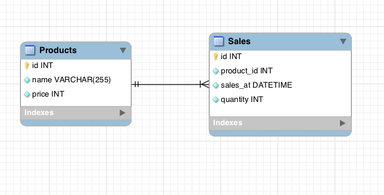
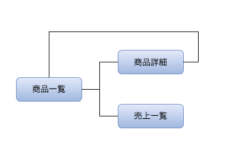
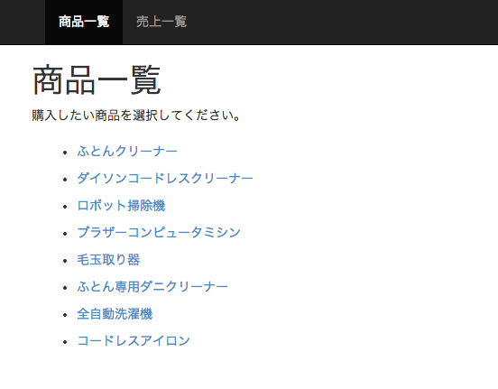
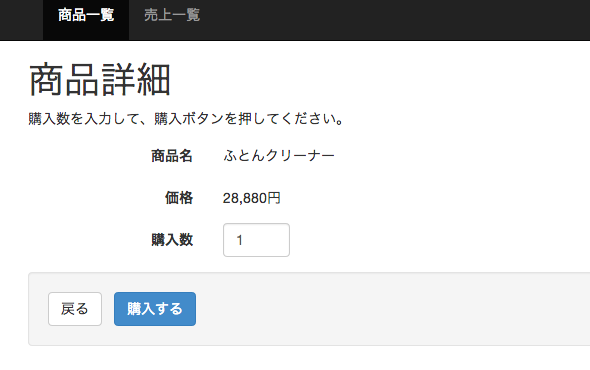
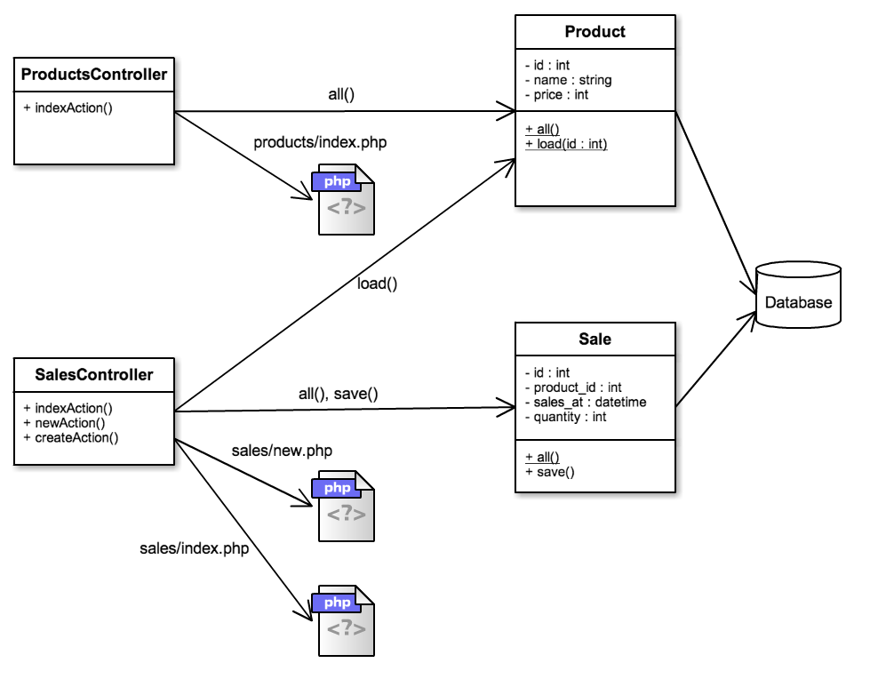

期末試験課題
========

下記の内容をよく読んで課題を行ってください。課題の内容に疑問がある場合には授業中に質問するか、hamada.syougo@mountposition.co.jp 宛にメール、Facebook（https://www.facebook.com/hamada.syougo ）にメッセージのいずれかで連絡してください。

### 試験概要

* Webプログラミング演習Ⅱの期末試験は本課題を **GitHub のリポジトリに収めることで提出完了とします**。
* 期末試験では、実務で使える技術（GitHub、DataBase、オブジェクト指向、etc..）を使用します。
* 試験課題の提出ができなかった生徒は、筆記による追試も考えています。
* 試験課題中に作成してもらう HTML は自由にデザインして構いません。デザインは採点の対象にはしません。
* 課題の締切りは **2014/02/03 13:00（午後1時）** とします。この時点でリポジトリにコミットされているもので採点を行います。**忘れずに GitHub 上のリモートリポジトリにコミットを行ってください。同期処理を忘れるとGitHub 上にコミットされません。**
* 追試が必要な人には別途連絡を行います。追試期間は **2014/02/04 〜 2014/02/08** とします。
* 仕様のところで記載されている通りの出力が行われるようにプログラミングを行ってください。

---

## 課題の提出方法

試験は GitHub にリポジトリを作成し、コミットを行うことで提出完了とします。ただし、どうしても GitHub を利用できない場合には別途提出方法を提示するので相談してください。

* [GitHub はこちら（https://github.com）](https://github.com)

#### 手順1：アカウントを作成する

GitHub にアカウントを作成します。アカウントの作成方法は Lecture2 の資料を参考にしてください。 **作成時のユーザ名は学籍番号にしてください。**

#### 手順2：GitHub for Windows、GitHub for Mac をインストールする

GitHub を簡単に利用するためのツールがあるのでインストールを行います。Windows 版は [GitHub for Windows（http://windows.github.com/）](http://windows.github.com/)、Mac 版は [GitHub for Mac（http://mac.github.com）](http://mac.github.com) になります。

#### 手順3：提出用のリポジトリを作成する

GitHub 上に **webpro2exam** という名前のリポジトリを作成します。

#### 手順4：新規ファイルをコミットする

リポジトリに最初のファイルをコミットします。 **ファイル名に学籍番号を入力し、中身は空のファイルをコミットしてください。**


#### 手順5：課題の内容をコミットする

期末課題を実施して、出来上がったところからコミットを行ってください。

---


# 試験課題

期末課題では、商品と売上を管理するシステムを作成してもらいます。データベースで商品マスターと売上を管理し、画面では、商品一覧ページ、商品購入ページ、売上一覧ページを作成してもらいます。

次の課題を解いて、プログラムを完成させてください。

1. データモデルを確認し、データベースにテーブルを作成すること。データベース作成、テーブル作成、初期データ投入は、初期投入用の SQL 文を利用すること。テーブル作成の SQL 文は各自考えて記述する。
2. 画面仕様を確認して、Webプログラム部分を作成する。プログラムの構造は「アーキテクチャ」の部分にしたがって作成すること。


## 仕様

### データモデル



データベースでは上のデータを管理します。下記にテーブル定義を記載します。

| テーブル名 | 論理テーブル名 |
|------------|----------------|
| Products   | 商品           |
| Sales      | 売上           |

##### 商品テーブル

| カラム名 | 論理カラム名 | 型           | 説明   |
|----------|--------------|--------------|--------|
| id       | 商品ID       | INT          | 主キー |
| name     | 商品名       | VARCHAR(255) |        |
| price    | 価格         | INT          |        |

##### 売上テーブル

| カラム名   | 論理カラム名 | 型       | 説明                                                                 |
|------------|--------------|----------|----------------------------------------------------------------------|
| id         | 売上ID       | INT      | 主キー                                                               |
| product_id | 商品ID       | INT      | 外部キー。売上商品のIDを格納する。                                   |
| sales_at   | 売上日時     | DATETIME | 販売日時を格納する。購入処理時点の現在日時をプログラムから投入する。 |
| quantity   | 販売個数     | INT      | 販売個数を格納する。画面から入力される値を投入する。                 |


##### 初期データ投入用の SQL 文

```sql
CREATE DATABASE webpro2examdb DEFAULT CHARACTER SET utf8;
use webpro2examdb;

/* TODO ここにテーブル作成のSQLを記述する。 */

INSERT INTO products (id, name, price) VALUES
    (1, 'ふとんクリーナー', 28800),
    (2, 'ダイソンコードレスクリーナー', 47610),
    (3, 'ロボット掃除機', 51500),
    (4, 'ブラザーコンピュータミシン', 18900),
    (5, '毛玉取り器', 2480),
    (6, 'ふとん専用ダニクリーナー', 17800),
    (7, '全自動洗濯機', 55000),
    (8, 'コードレスアイロン', 5980);
```

データベースへのアクセスは、Lecture3 を参考にしてください。

---

### 画面

画面遷移は次のようになります。



##### 商品一覧画面



##### 商品購入画面



##### 売上一覧画面


---

### アーキテクチャ

アーキテクチャは MVC とします。ここに現れていないクラスやメソッドを追加することは問題ありません。このアーキテクチャ図は参考程度のものです。

MVCフレームワークは次のサイトを参考にしてください。

* http://jehupc.exblog.jp/19260662/
* http://jehupc.exblog.jp/19260670/





##### クラスの役割

| クラス名 | 説明 |
|----------|------|
| ProductsController | 商品一覧画面の処理を受け持つクラス。`indexAction` メソッドで `Product#all` を呼び出し商品一覧を取得したら、`products/index.php` で一覧画面を表示する。 |
| SalesController | 売上一覧画面と購入画面の処理を受け持つクラス。`indexAction` メソッドでは売上一覧画面を、`newAction` メソッドでは購入画面を表示する。`createAction` メソッドでは購入処理として `Sale#save` を呼び出して購入データをデータベースに保存する。 |
| Product | 商品モデル。`all` メソッドはデータベースから商品データを全て取得して返す。`load` メソッドは指定された ID の商品データのみをロードする。 |
| Sale | 売上モデル。`all` メソッドはデータベースから全ての売上データを取得して返す。`save` メソッドは自分自身のデータをデータベースに保存する。 |
| products/index.php | 商品一覧画面のテンプレート |
| sales/new.php | 購入画面のテンプレート |
| sales/index.php | 売上一覧画面のテンプレート |

---

## 開発のヒント

### MVC アーキテクチャで View 部分を表示する方法は、PHP の `include` 構文が使えます

##### products_controller.php

```php
<?php
class ProductsController {
    public function index() {
        // 何かの処理...

        $model_data = array('テレビ', '掃除機', '洗濯機');
        include('views/products/index.php');
    }
}

$controller = new ProductsController();
$controller->index();
```

##### products/index.php

```html
<!DOCTYPE html>
<html lang="ja">
<body>
    <ul>
    <?php
        foreach ($model_data as $name) {
            echo "<li>${name}</li>";
        }
    ?>
    </ul>
</body>
</html>
```


### モデルクラスの属性をコントローラやビューの中で参照や設定をしたい場合は、モデルクラスに getter/setter を用意します

アーキテクチャのクラス図を見るとわかるように、`Product` や `Sale` のクラスには `private` な属性(id, name など)があります。private な属性は自分自身のクラスの中からしか参照することができません。別のクラスからも参照したい場合には、`getId` や `setName` などのメソッドを用意します。

```php
<?php

class Sale {

    private $id;
    private $product_id;
    private $sales_at;
    private $quantity;

    public function __construct($params) {
        $this->id         = isset($params['id']) ? $params['id'] : null;
        $this->product_id = isset($params['product_id']) ? $params['product_id'] : null;
        $this->sales_at   = isset($params['sales_at']) ? $params['sales_at'] : null;
        $this->quantity   = isset($params['quantity']) ? $params['quantity'] : null;
    }


    public static function all() {
    }

    public function save() {
    }

    public function getId() {
        return $this->id;
    }

    public function setId($id) {
        $this->id = $id;
    }

    public function getProductId() {
        return $this->product_id;
    }

    public function setProductId($product_id) {
        $this->product_id = $product_id;
    }

    public function getSalesAt() {
        return $this->sales_at;
    }

    public function setSalesAt($sales_at) {
        $this->sales_at = $sales_at;
    }

    public function getQuantity() {
        return $this->quantity;
    }

    public function setQuantity($quantity) {
        $this->quantity = $quantity;
    }

}
```


### データベースの ID カラムに自動で連番を振る方法

売上データを登録する際に、ID カラムに自動で連番を振りたいと思います。そんなときはテーブル作成時に ID カラムに AUTO_INCREMENT を指定しましょう。

```sql
CREATE TABLE sales(
    id integer primary key AUTO_INCREMENT,
    /* 略 */
);
```


### PDO を使ったデータベース処理でよくわからないエラーが起こったら

PDO には直前に発生したエラーを取得するための `errorInfo` というメソッドが用意されています。エラーが起こっているかどうか確認したい場合にはこのメソッドを使いましょう。

```php
<?php
$pdo = new PDO('略', '略', '略');
$stmt = $pdo->prepare('略');

if ($stmt) {
    $stmt->bindParam(/* 略 */);
    if ($stmt->execute()) {
        /* 略 */
    } else {
        var_dump($stmt->errorInfo());
    }
} else {
    var_dump($pdo->errorInfo());
}
```
